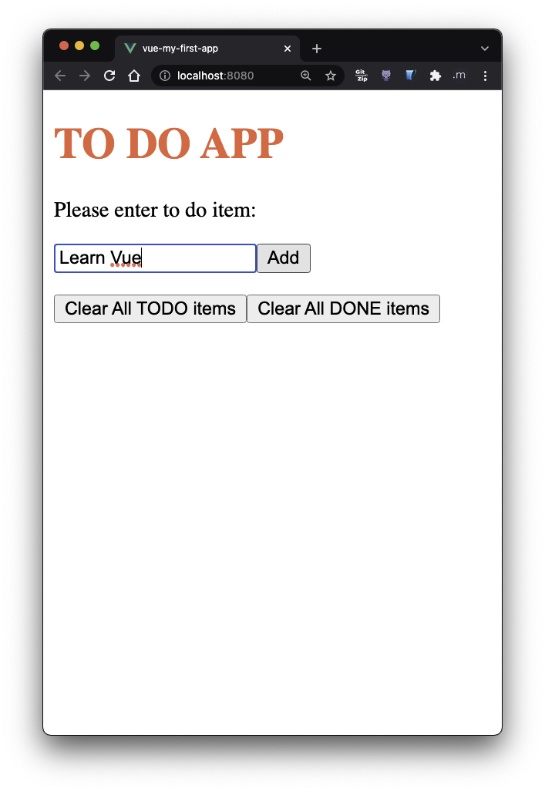
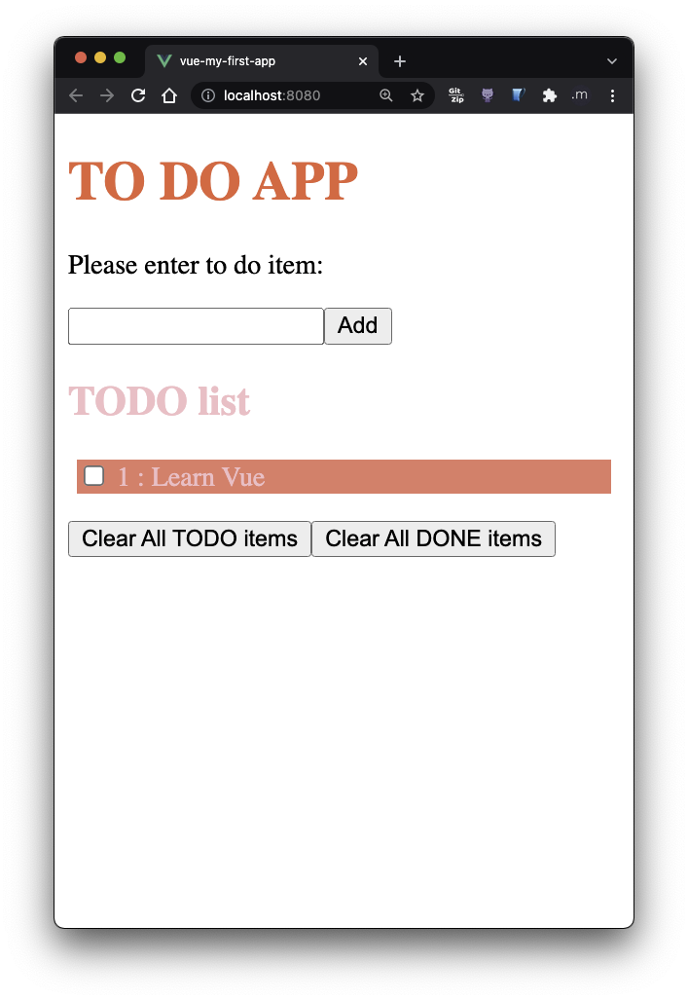
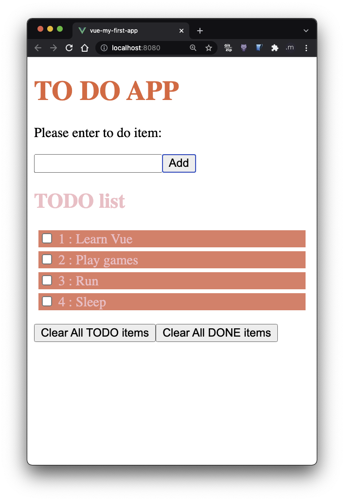
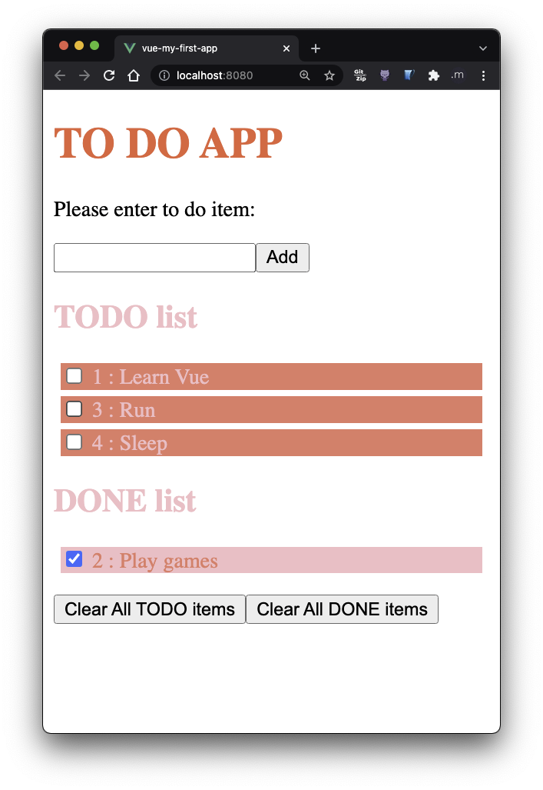
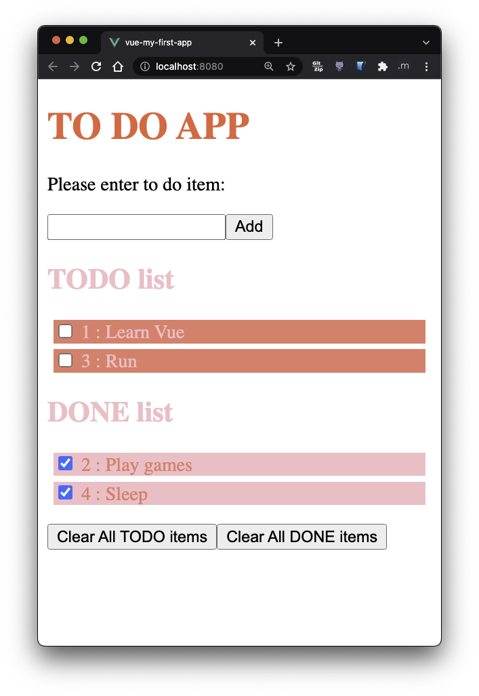
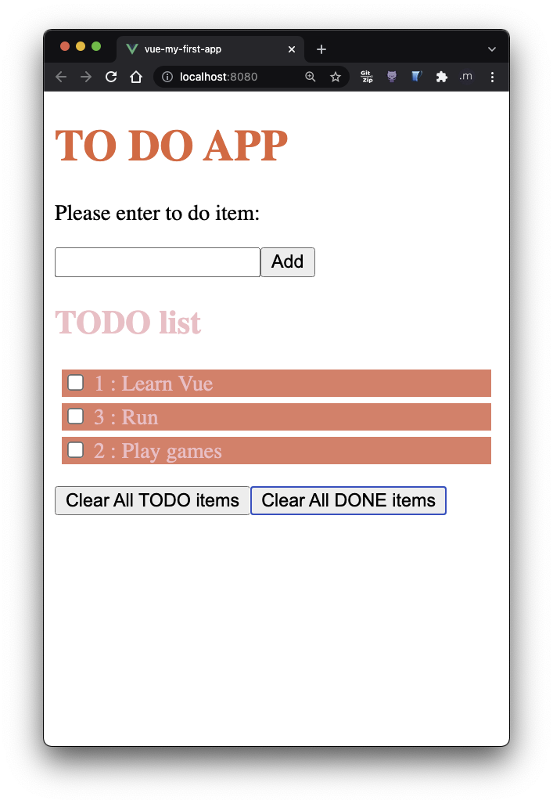
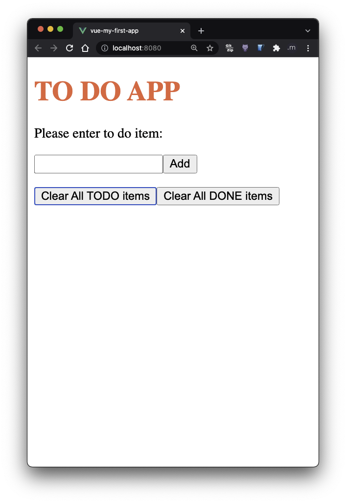

# ASN 05 - Vue CLI

Create a todo list application.
The app shall works as follow.

Note: the template doesn't have **node_modules**. Please run **npm install** first.

Step1: When we start the app, it shall look like this.

User can type the text as the todo item.

When user clicks "Add". The text in the input box should disappear.
The label "TODO list" should show up and the item the user just added should appear below.

The user can keep adding more items.

If the user click at the checkbox, the todolist shall be removed from the list.
The label "DONE list" should show up and the item user just finished should show up below with the checkbox checked.

The user can check more items from the todo list.
Those items will appear under the label "DONE list".

If the user change his/her mind about the done item, the user can uncheck the done item. That item will go back under "TODO list".

The user can clear all the done items by clicking the button.
Notice that, when there is no done item, the label "DONE item" disappears.

The user can clear all the todo items by clicking the button.
Notice that, when there is no todo item, the label "TODO item" disappears.

